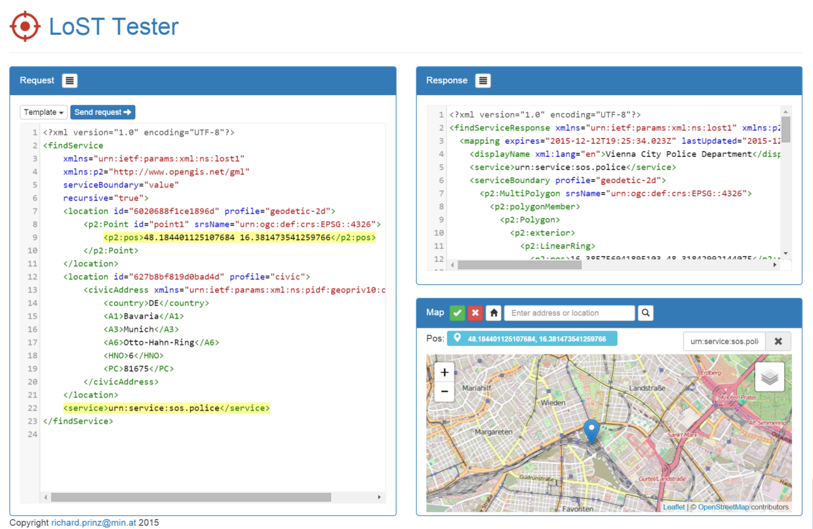

# LoST-Node
A [RFC 5222](https://tools.ietf.org/html/rfc5222) compatible node.js based LoST server.

## Objectives
Basic idea for this project was to have a very lightwight
implementation of a [RFC 5222](https://tools.ietf.org/html/rfc5222) lost server to perform tests with.
At the time as development starts there where no public 
implementations for my testing purposes available so lost-node
was born.

lost-node should be:
* very lightwight and performant. So node.js and mongodb are
  used.
  * https://nodejs.org
  * https://www.mongodb.org
* easy to develop and play with (even just on an USB-stick
  on the go)
* should use Open Data Protocol (oData) to connect to the
  backend database as well as use oData to clients (e.g.
  for a management client). See the following links for
  more infos:
  * http://www.odata.org
  * http://jaydata.org
* should include a testing application to play with lost
  request
* should be easily deployable to the cloud (e.g. amazon,
  azure, mongolab ...)
* should use the XML relax ng schema for request validation
  directly from the RFC (hence libxml which provides relax
  ng support). For more infos see:
  * http://relaxng.org/
  * https://github.com/polotek/libxmljs/pull/273
  * https://tools.ietf.org/html/rfc5222#appendix-A

## Installation
First ensure that all dependencies are available on the
server: 
* mongodb
* node.js

To install lost-node first place the distribution zip file
"lost.zip" which is created during buid somewhere on your 
server and unzip it. Then install all required node.js 
modules with `npm install --production` inside the `dist` 
folder. This also triggers some native build 
processes for some node modules (e.g. xmllib).
If you use Windows see the notes section for more infos.
 
Next change folder to `dist/config/env/` and modify an existing
configuration (production.js, development.js) or create a 
new one. After this change the `start_server` shell script
to match your configuration.

## Usage
First start the mongodb server with the
`start_mongo.cmd` batch file. Then in another shell start
the server with `start_server.cmd`. Now open your browser
and navigate to http://locahost:8080.

To create (or delete an existing) an empty lost mongodb database
use `start_server -i` to initialize.

`start_server -t` creates some testing data. At the moment 4
areas (all inside Austria: Vienna, Linz and Salzburg) and two 
services (urn:service:sos.police and urn:service:sos.fire)
are created.

`start_server` without options just starts the LoST server itself.

To change TCP port, url etc. edit `config/env/development.js` or
`config/env/production.js`.

### The lost tester

To play with LoST request and responses the included lost-tester
allows to select one of the four LoST reuests (findService, 
getServiceBoundary, listServices and listServicesByLocation),
a location on the map and a requested service which are 
integrated into the request. The service response is then
displayed.

## Contributing / Developing
1. Fork it!
2. Create your feature branch: `git checkout -b my-new-feature`
3. Commit your changes: `git commit -am 'Add some feature'`
4. Push to the branch: `git push origin my-new-feature`
5. Submit a pull request :D

To start development ensure you have the following dependecies
installed:

1. node.js 
   Download and install node from https://nodejs.org/en/ 
2. grunt-cli 
   Install using `npm install -g grunt-cli`
3. bower 
   Install using `npm install -g bower`
4. tsd 
   Install using `npm install -g tsd`
5. For some node modules a native build environment is needed
   * gcc for linux
   * Visual Studio (Express) on windows.  
6. optional: Visual Studio Code (vscode) 
   Download and install from https://code.visualstudio.com/ 

Then inside the lost-node folder issue the following commands:

1. `npm install` 
   If you use Windows see the notes section for more infos.
2. `bower install`
3. `tsd install`
4. open lost-node folder with vscode and start coding
5. CTRL+SHIFT+B in vscode builds project - or -
   to build project from command line enter `grunt build`
6. After build `dist` folder contains redistributable built
   project (also available in compressed `lost.zip` archive in
   project root folder)
7. `grunt release` builds project in "mangled/encrypted" form
8. To run project enter:
   `start_mongo` and then `start_server`
9. `start_server -t` creates testing data.
10. F5 in vscode starts server (and server debugging)

##Notes
* lost-node is developed with:
  * node.js version 4.2.2
  * mongodb version 3.0.7
  * Visual Studio Code version 0.10.3
 
* JayData odata-server / jaydata 1.3.6 node module does not work with 
mongodb client >= 2.0
(see https://www.mongodb.com/blog/post/introducing-nodejs-mongodb-20-driver)
So use the latest 1 version (1.4.39) instead. This is also defined in
package.json

* Also note that this version is not complete und highly untested.
Feel free to contribute to make lost-node better. Especially missing
in this version are forward and redirect functionalities and a
management frontend.

* For windows, binaries for mongodb, the VUE admin tool and
  the libxmljs node modules are included. So you dont need 
  mongodb or Visual Studio installed on windows. To use it
  follow this instructions:
  1. before running `npm install` copy the `package.json` file
     to a safe place. Next remove the following lines
     in the dependencies section from `package.json`:
     * libxml-to-js
     * libxmljs
     * mongodb
     * odata-server
  2. run `npm install`
  3. inside the `build` folder you will find `windows_prebuilt_modules.zip`.
      Extract its contents into the `node_modules` folder.
  4. Restore the `package.json` backup from point 1.
  5. Run `npm install` again to install the remaining dependencies.
  6. Now you should have all dependencies installed.  

* The LoST testing application supports multiple map providers. For Google and
Microsoft BING Maps you will need an API key. See the notes in the corresponding
soures files:
  * source/client/test.html - Google Maps
  * source/client/assets/js/nl.map.js - BING Maps

## History
* Alpha Version 15.4.2015
* First Beta 21.11.2015

## Credits
Credits go to all used components like node modules or libraries.

## License
This project is under GNU GPLv3.
See file gpl-3.0.txt in this project or http://www.gnu.org/licenses/gpl-3.0.html

